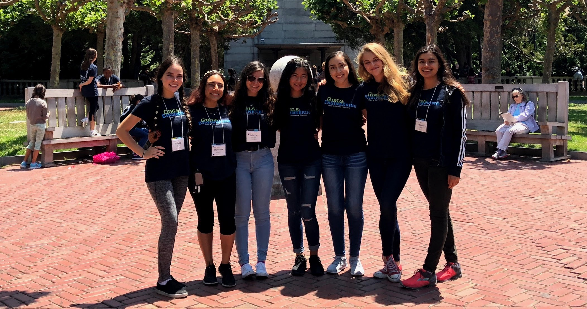
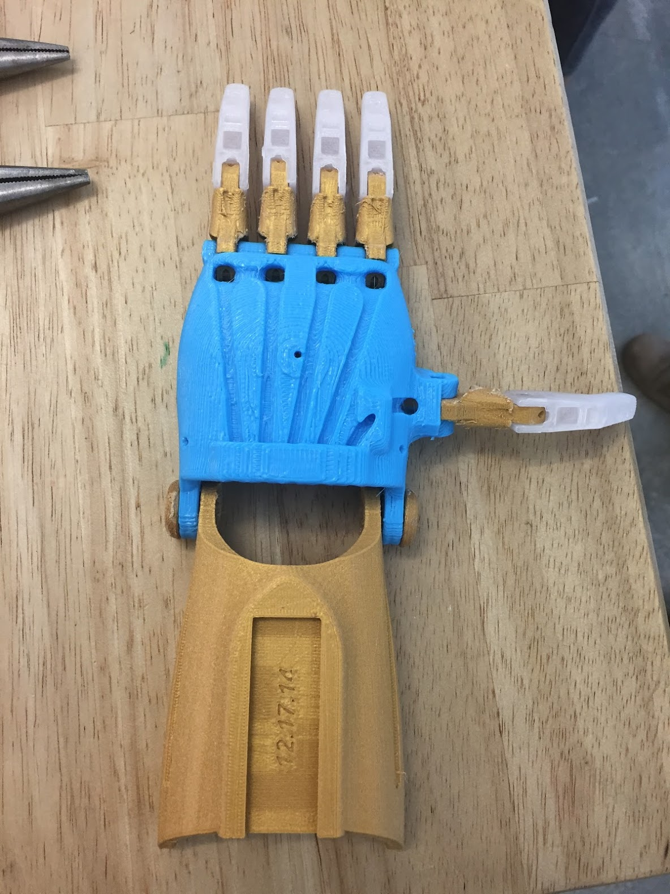
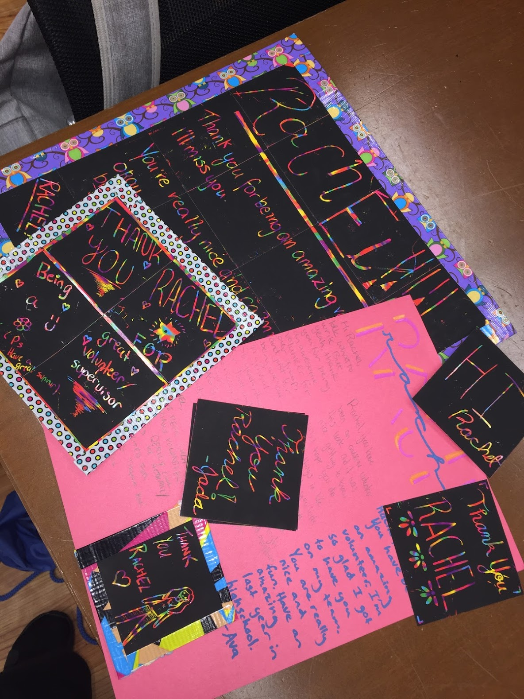
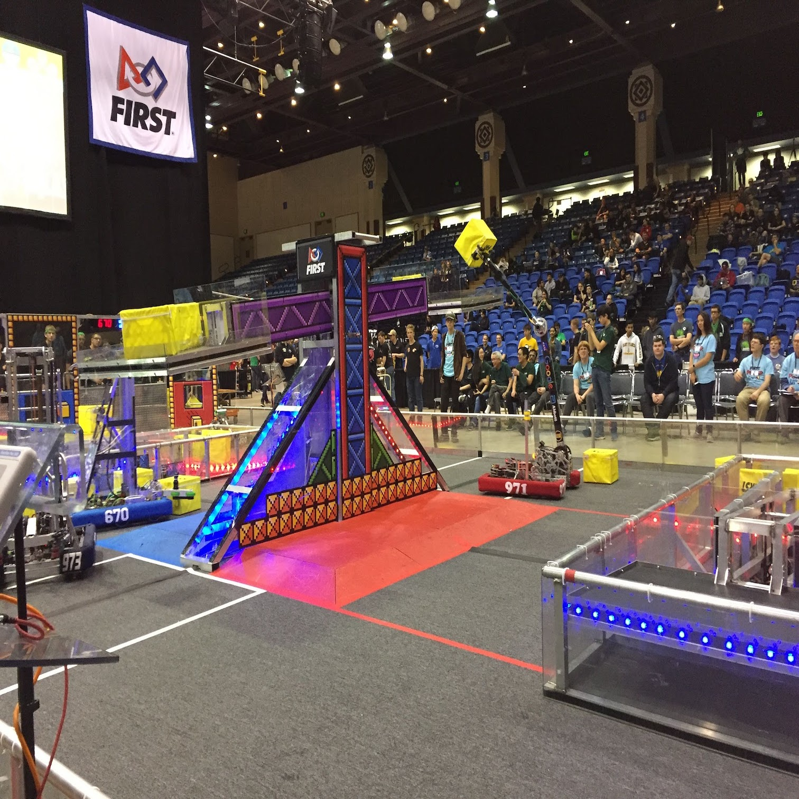
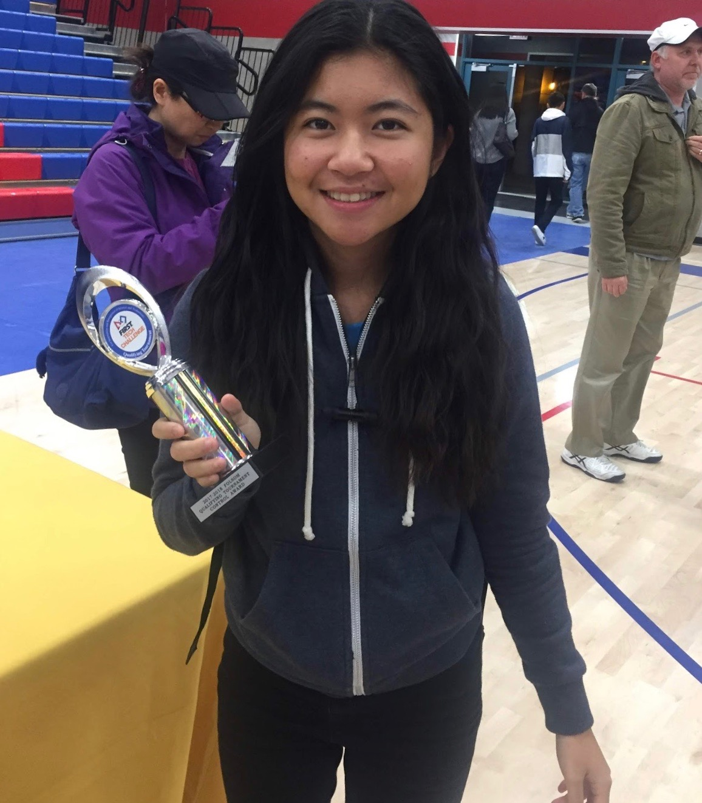
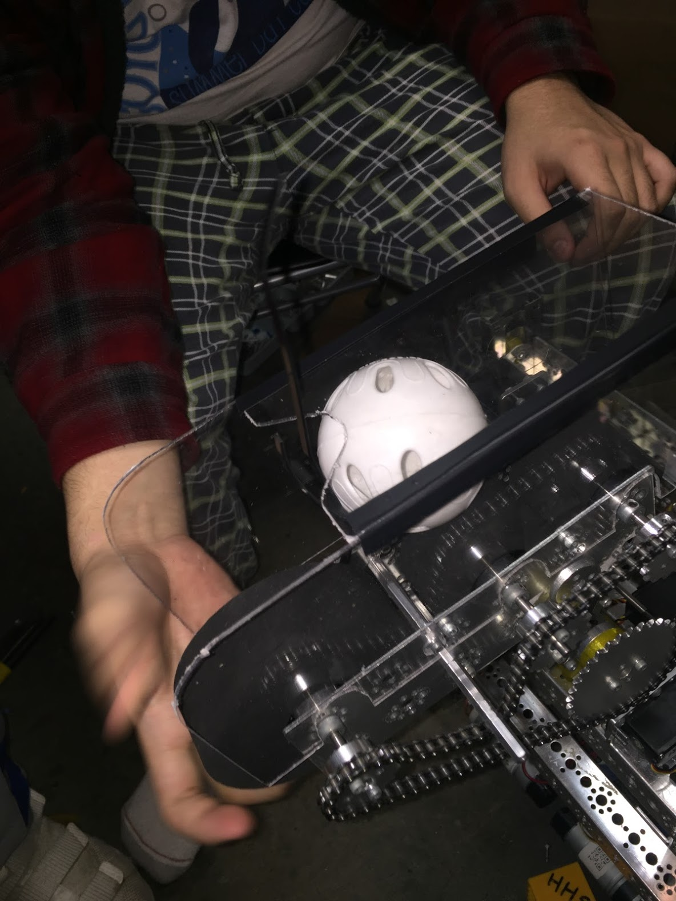

<!-- Main -->

<!-- One -->
<section id="one">
	

		<header class="major">
			<h1>Experience</h1>
		</header>

<!-- Content -->
<h2 id="content">Girls in Engineering Program Group Lead Volunteer</h2>
<h4>University of California, Berkeley | July 2018</h4>

	

		

		

		

	

		

	
	
Encouraged young girls explore different fields of engineering as a group leader for two weeks in the Girls in Engineering program. Built 3D printed prosthetic hands, explained practicalities of self-driving cars and demonstrated creative projects of biomimicry.

	

<h2 id="content">Robotics Club FTC Team 3470 President</h2>
<h4>Brentwood, CA | August 2018 - July 2018</h4>

	

		

		

		

	

<ul class="actions"> 
	<button onclick="window.location.href = 'https://docs.google.com/document/d/16JOS3bRpUHqcP99KiMP5p6IJ23MM9XNvWZTQhgpomKo/edit?usp=sharing';">Engineering Notebook</button>
</ul>

	
Managed engineering notebook, outreach events, build sessions, and mechanical and software engineering of robot.
Created budget plans, handled finances, and fundraised over $5000 throughout the team's season. Efficiently delegated tasks among team members and fostered a collaborative, learning environment. Won the FTC Control Award at Folsom tournament for most accurate and consistent autonomous programs and sensors. Volunteered in FRC championship tournaments to help facilitate field setups in teams.

